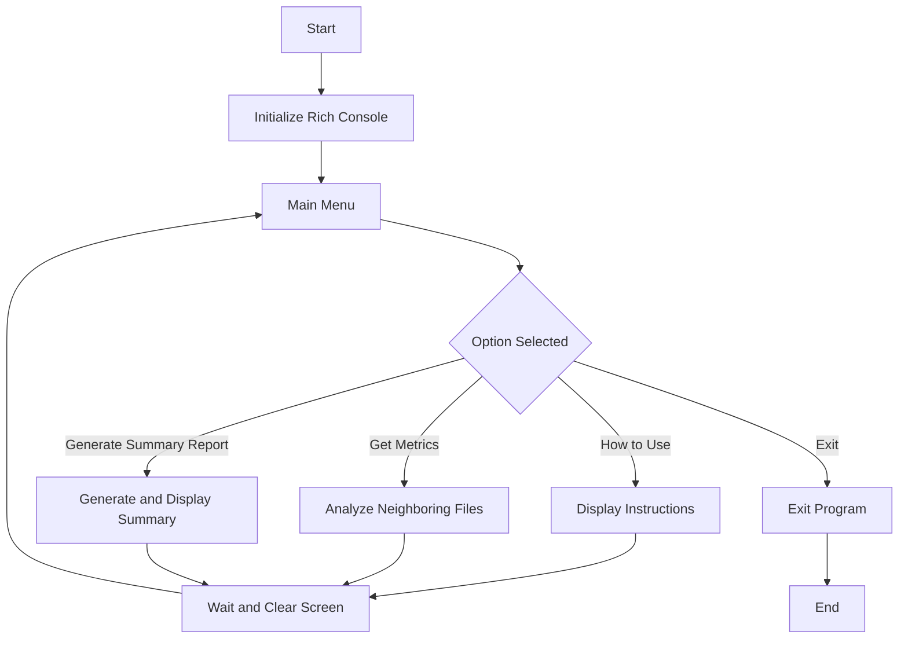

# Group 1

 *Members:*

 - Luis Vazquez
 - Landon Brown
 - Kendall Lawson

## Project Management Tools

 *Atlassian Jira*
 - https://luisgvazquez.atlassian.net/jira/software/projects/SCRUM/boards/1/backlog

## Commmunication Tools
*Microsoft Teams*
- https://teams.microsoft.com/l/channel/19%3ADYcUuSjcvCI-eA39mqTVg7ur5DsJSGhMAFOxbh6MC5k1%40thread.tacv2/General?groupId=e3b61ff2-7072-4d64-9c95-797850a824e4&tenantId=

## Project Flowchart 

## Instructions (will be updated as project evolves)

*Install Instructions:*
- Install python
- Install pip3
- Create virtual environment
- Activate virtual environment
- Install requirements.txt file
- Run main python file

*Use Instructions:*
- When it asks for link provide url for youtube video
- When it asks for audio or video: Type a or v
  - If A is selected, select quality and type in High or Low, video will be converted and downloaded as an mp3 audio file
  - If V is selected video will be downloaded as an mp4 video file
- When it asks you if you want to download another video
  - If you select yes, the process will start again
  - If you salect no the program will exit

